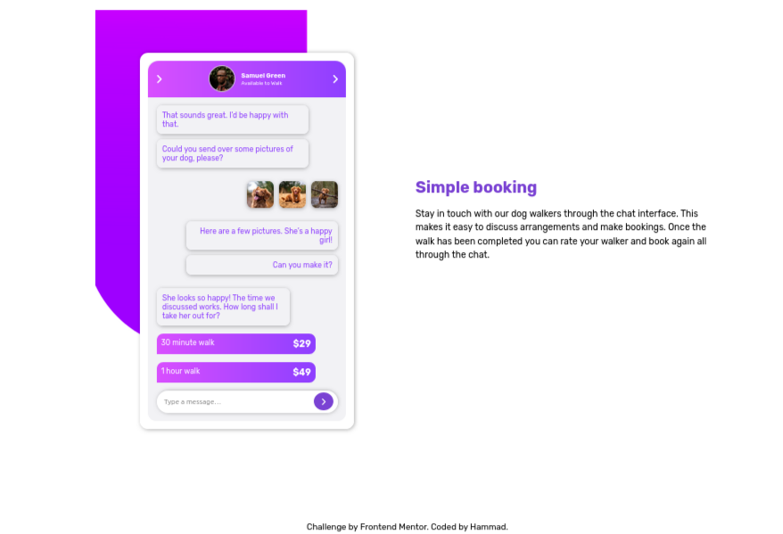
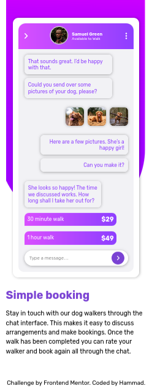

# Chat App UI — Frontend Mentor Challenge

## 📌 Overview

A responsive chat application UI built as part of a [Frontend Mentor](https://www.frontendmentor.io) challenge. The design features a mobile chat mockup alongside a description section, with a clean purple gradient theme.

### 🔗 Links

- **Live Site:** [chat-app-opal-delta-81.vercel.app](https://chat-app-opal-delta-81.vercel.app/)
- **Repository:** [github.com/hammad-bin-siddique/chat-app](https://github.com/hammad-bin-siddique/chat-app)

---

## 📸 Screenshots

### Desktop View

### Mobile View

---

## 🛠️ Built With

- Semantic **HTML5**
- **CSS3** (Custom Properties, Flexbox, Media Queries)
- **Google Fonts** — Rubik
- **Font Awesome** — Icons
- Mobile-first responsive design

---

## 💡 What I Learned

- Using CSS custom properties (variables) for consistent theming
- Building a realistic mobile UI mockup with pure CSS
- Applying CSS gradients to create a vibrant purple/pink color scheme
- Handling responsive layouts with Flexbox

---

## 📱 Contact

Have a question or want to connect?

- **WhatsApp:** [+92 324 5469030](https://wa.me/923245469030)
- **GitHub:** [hammad-bin-siddique](https://github.com/hammad-bin-siddique)

---

## 🏆 Acknowledgements

- Challenge by [Frontend Mentor](https://www.frontendmentor.io)
- Coded by **Hammad**
